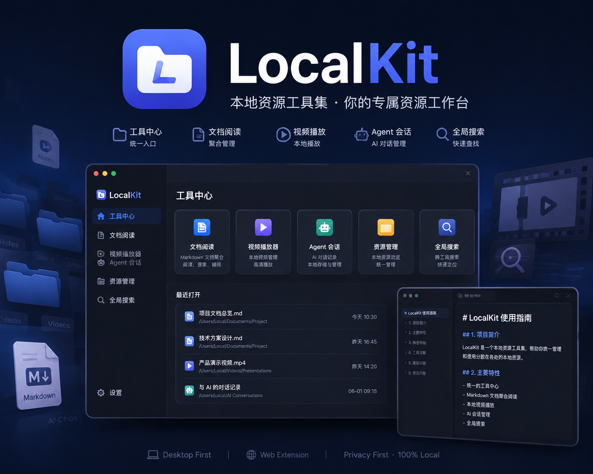
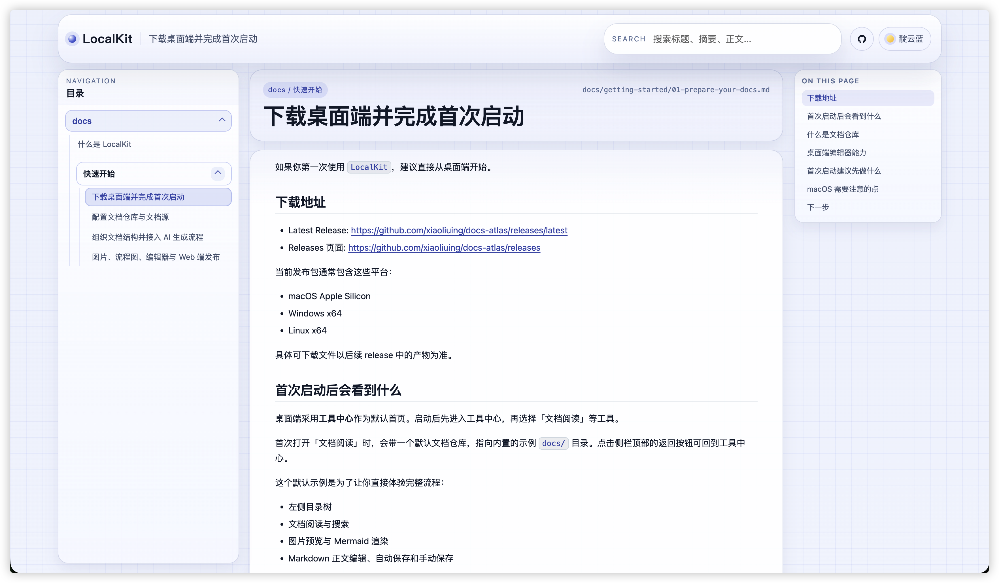
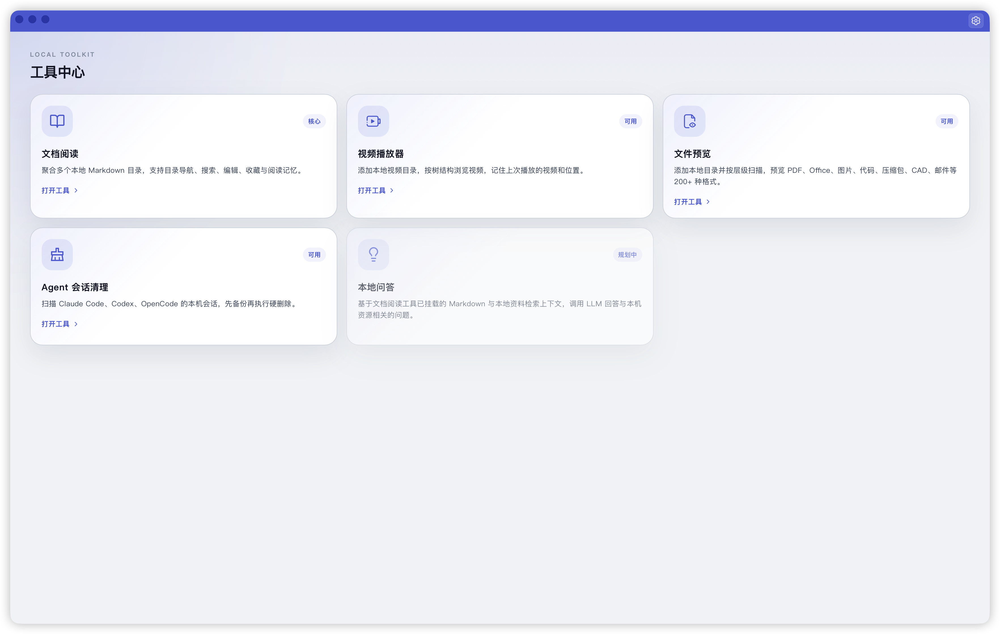

# LocalKit

[](./LICENSE)

<div align="center">
  
</div>


LocalKit 是一个**本地资源工具集**，当前以桌面端为主，Web 端作为文档阅读能力的预览、分享和静态发布延伸。

它解决的问题很直接：Markdown 文档、视频资料、Agent 会话等本地资源往往散落在不同目录、不同工具里，入口不统一，上下文切换成本高。LocalKit 用工具中心把分散的本地资源重新组织起来，文档阅读是其中最成熟的一项工具。

## 项目定位

LocalKit 不是在线协作平台，也不是后台 CMS。

它更像一个开发者本地的**资源工作台**，重点能力是：

- 通过工具中心统一进入各类本地资源工具
- 用「文档阅读」工具聚合多个 Markdown 目录，完成浏览、搜索、编辑
- 用「视频播放器」等工具管理其他本地资料
- 为 AI 生成文档提供稳定的落地和维护入口

当前阶段，项目以 `Desktop` 为主产品形态，`Web` 为文档阅读的补充发布能力。

## 下载与体验

在线演示：

- Web Demo: https://xiaoliuing.github.io/LocalKit/



桌面端下载：

- Latest Release: https://github.com/xiaoliuing/docs-atlas/releases/latest
- Releases 页面: https://github.com/xiaoliuing/docs-atlas/releases



当前可下载资产包括：

- macOS Apple Silicon: `.dmg`
- Windows x64: `.exe` / `.msi`
- Linux x64: `.AppImage` / `.deb` / `.rpm`

注意：

- 当前 macOS 包未接入 Apple 签名与 notarization
- 在部分 macOS 设备上，首次打开可能需要用户在系统安全设置中手动放行

## Desktop 端能做什么

桌面端是 LocalKit 的主形态，采用**工具中心 + 独立工具**结构。

### 工具中心

统一入口，展示所有本地资源工具。当前可用：

| 工具 | 能力 |
|------|------|
| **文档阅读** | 文档仓库管理、多源聚合、搜索、编辑、收藏、阅读记忆 |
| **视频播放器** | 本地视频目录浏览、播放进度记忆 |
| **Agent 会话清理** | 扫描并清理 Claude Code / Codex / OpenCode 本机会话 |

### 文档阅读工具（核心）

- 每个文档仓库独立配置文档源，支持嵌套分组
- 目录按专题、README 入口页和自然顺序展示
- 全局搜索 / 当前文档仓库搜索切换
- 直接编辑 Markdown 正文，并保存回本地文件
- 记住文档仓库、阅读位置、滚动状态和目录展开
- 图片预览、代码高亮、文档大纲、上一篇 / 下一篇
- 文档仓库配置导入 / 导出、本地目录扫描和变化监听

### 适合的场景

- 管理多个项目的设计文档与 AI 生成文档
- 在本机统一阅读和维护 Markdown 资料
- 同时管理文档、视频、Agent 会话等本地资源
- 作为长期演进中的个人本地工作台

## Web 端能做什么

Web 端是**文档阅读工具**的只读发布延伸，不是主产品形态，但仍然很重要。

它适合：

- 本地预览文档目录
- 将文档聚合结果部署为静态站点
- 给团队或外部读者提供只读入口

当前能力：

- SSG 静态站点构建
- 多文档源聚合
- 嵌套分组目录
- Markdown 渲染、代码高亮、图片预览
- 搜索、目录导航、主题切换
- GitHub Pages 等静态托管部署

## 文档组织规则

推荐结构：

```text
docs/
├── backend/
│   ├── README.md
│   ├── 01-architecture.md
│   └── 02-api-design.md
├── mobile/
│   ├── README.md
│   └── 01-build-process.md
└── overview.md
```

规则：

- 一级目录视为一个专题
- 专题下的 `README.md` 是入口页
- 其他 Markdown 作为正文文档展示
- 根目录下直接放置的 Markdown 会作为独立文档显示
- 目录排序采用目录优先、`README.md` 优先、自然数字排序
- 图片相对路径按文档所在目录解析

如果你要让 AI 生成内容直接接入 LocalKit，最稳妥的方式是让 AI 也遵守这套目录规则。

## Desktop 优先的使用方式

### 1. 下载桌面端

从 Release 页面下载与你平台匹配的安装包：

- https://github.com/xiaoliuing/docs-atlas/releases/latest

### 2. 从工具中心进入文档阅读

启动后默认进入工具中心。点击「文档阅读」卡片即可打开 Markdown 阅读工具，自带指向 `docs/` 示例目录的默认文档仓库。

### 3. 创建或使用文档仓库

进入文档阅读后，可以新建文档仓库，或继续使用默认示例仓库：

- 新建文档仓库
- 修改文档仓库名称、颜色和搜索范围
- 给每个文档仓库挂多个文档目录
- 使用嵌套分组组织不同来源

### 4. 添加文档源

文档阅读工具不依赖 `config.yaml`，直接在界面里维护文档源树：

- 可添加本机目录
- 可手动输入路径
- 可校验路径是否有效
- 可按分组整理多个来源

### 5. 开始阅读、搜索与编辑

- 浏览目录、阅读 Markdown
- 直接修改文档内容并保存回本地文件
- 搜索当前文档仓库或全局内容
- 继续上次阅读的位置

## Web 端的使用方式

如果你需要一个可部署的只读站点，可以使用 Web 端。

### 运行环境

- Node.js 20+
- pnpm 10+

### 安装依赖

```bash
pnpm install
```

### 本地开发

```bash
pnpm dev
```

### 构建静态站点

```bash
pnpm build
```

### 文档来源配置

Web 端默认读取项目内的 `./docs`。

如果要聚合多个目录，可以在项目根目录创建 `config.yaml`：

```yaml
docs:
  items:
    - path: ./docs
      name: local
    - name: Workspace
      items:
        - path: ../backend-docs
          name: backend
        - path: ../mobile-docs
          name: mobile
```

说明：

- `path` 支持相对路径和绝对路径
- `name` 是模块名称，也是构建命名空间
- `items` 支持递归嵌套
- `config.yaml` 优先级高于 `DOCS_CMS_DOCS_DIR`

## 仓库结构

```text
docs-cms/
├── apps/
│   ├── desktop/    # Desktop 主应用，基于 Tauri
│   └── web/        # Web 静态文档站
├── docs/           # 项目自带示例文档
├── packages/       # 共享类型与公共包
├── README.md
├── AGENTS.md
└── config.yaml
```

## 推荐阅读

- [什么是 LocalKit](./docs/what-is-localkit.md)
- [快速开始](./docs/getting-started/README.md)
- [桌面端发布说明](./DESKTOP-RELEASE.md)
- [AI 文档提示词模板](./LLM-PROMPT-TEMPLATE.md)

## 当前阶段

目前这个项目已经从「文档站 / 单一阅读器」走向「桌面端本地资源工具集」。

接下来的演进方向会继续围绕桌面端展开，包括：

- 丰富工具中心的工具种类
- 强化文档阅读工具的本地管理能力
- 更好的搜索和筛选
- 后续接入 LLM 问答等知识工具
